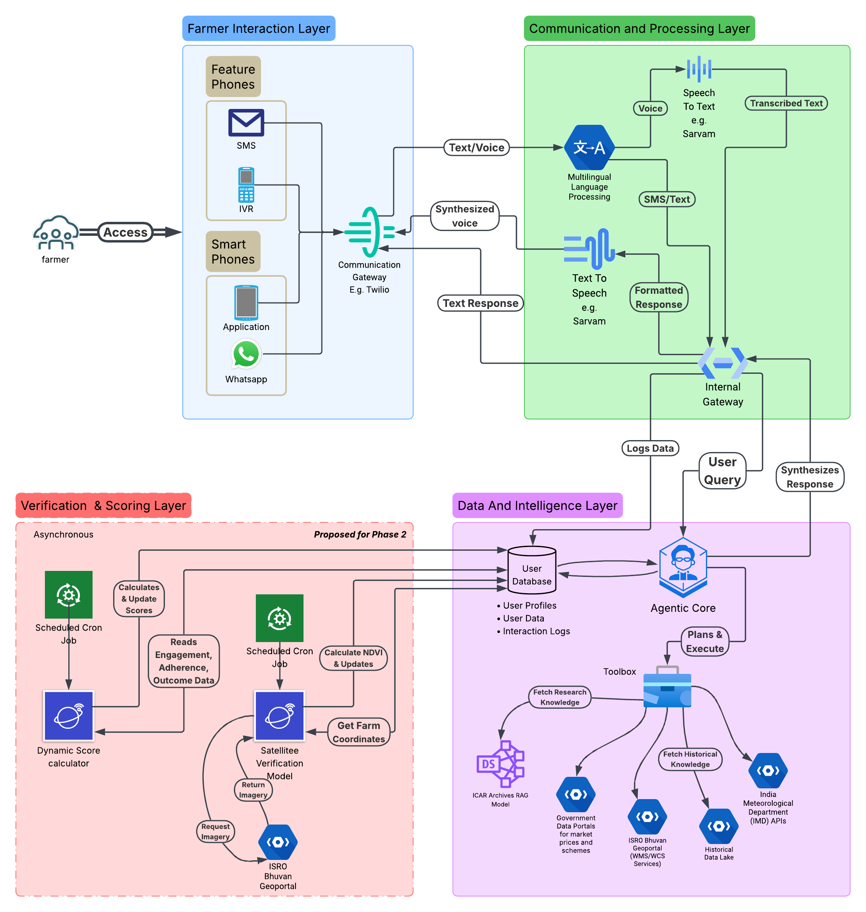

# NANDI: Your Farm's Financial Co-pilot

**From Invisible Hard Work to a Bankable Identity.**

---



### 🏆 **The Vision: Beyond Advisory, Towards Agency**

For millions of smallholder farmers in India, the challenge is not a lack of hard work, but a lack of financial identity. Their diligence, skill, and good practices remain invisible to the formal credit system, trapping them in a cycle of exclusion. Existing AgriTech solutions often cater to the digitally savvy, leaving a vast majority behind.[1]

**NANDI** is an AI-powered financial co-pilot designed to change this. It's not just another advisory app; it's a foundational ecosystem that builds a farmer's **verifiable financial identity** from the ground up, using their daily agricultural activities as the primary data source. By operating through the most accessible channels—**SMS and IVR calls**—NANDI transforms a farmer's daily work into a tangible, trustworthy, and bankable profile, unlocking their path to prosperity.

### 🎯 **The Problem: The Vicious Cycle of Data Gaps and Credit Exclusion**

- **The Accessibility Chasm:** Most modern AgriTech solutions require smartphones and consistent internet, creating a barrier for a huge segment of the farming population who rely on basic feature phones.[1]
- **Invisible Expertise:** A farmer's responsible practices—like water conservation or timely pest control—are unrecorded and unverified. This makes them appear "high-risk" to financial institutions.
- **Systemic Credit Exclusion:** This lack of verifiable data leads to profound regional disparities in credit distribution. Small and marginal farmers are systematically pushed out of the formal credit system, with large borrowers cornering an increasing share of agricultural loans.[2, 3] This forces them towards informal lenders, perpetuating a cycle of debt and low investment.

### ✨ **Our Solution: The NANDI Ecosystem**

NANDI is an AI agent that provides hyper-personalized advice and, most importantly, creates a **Dynamic Trust Score** for each farmer. This score is a living metric of creditworthiness built on real-world actions, not just traditional financial history.

1.  **Accessible Advisory:** A farmer can call or SMS NANDI to ask complex questions like, _"Will next week's rain damage my crop, and should I sell at the Rampur mandi now?"_
2.  **Intelligent Synthesis:** The NANDI agent deconstructs this query and uses its "Toolbox" to fetch real-time weather forecasts from IMD [4, 5], check live market prices from government portals, and consult its internal knowledge base of ICAR best practices.[6, 7]
3.  **Objective Verification (Phase 2):** The system doesn't just rely on self-reported data, which can be unreliable. A background service uses satellite imagery from **ISRO's Bhuvan Geoportal** to periodically calculate the **Normalized Difference Vegetation Index (NDVI)** for the farmer's geofenced plot. This provides objective, scientific proof of crop health and performance.
4.  **The Dynamic Trust Score:** Every interaction—every query, every confirmed action, and every positive satellite verification—contributes to the farmer's score. This score transforms their previously invisible expertise into a powerful, alternative data asset that financial institutions can use for credit assessment, bridging the credit gap.

### 🛠️ **System Architecture & Technology Stack**

Our system is built on a robust, four-layered architecture designed for accessibility, intelligence, and integrity.

_(The Mermaid diagram from the previous step can be embedded here if you are using a compatible Markdown viewer like GitHub's)_

| Layer               | Component              | Key Technologies & Data Sources                                                                                                                                                                                                |
| :------------------ | :--------------------- | :----------------------------------------------------------------------------------------------------------------------------------------------------------------------------------------------------------------------------- |
| **1. Interaction**  | Multi-Channel Gateway  | Twilio/Exotel API, WhatsApp Business API                                                                                                                                                                                       |
| **2. Processing**   | Multilingual Engine    | **STT/TTS:** Soniox/ElevenLabs for Hindi, Tamil, Telugu.[8, 9, 10, 11] **Intent:** Lightweight ML (Naive Bayes).[12, 13]                                                                                                       |
| **3. Intelligence** | Agentic Core & Toolbox | **Framework:** LangChain/LlamaIndex. **LLM:** GPT-4/Claude 3/Gemini. **Vector DB (RAG):** ChromaDB with ICAR docs [6, 7], PMFBY/KCC scheme PDFs.[14, 15, 16, 17] **APIs:** IMD Weather [4, 18, 19], data.gov.in Market Prices. |
| **4. Verification** | Trust Engine (Async)   | **Satellite Data:** ISRO Bhuvan WMS/WCS API.[20, 21, 22] **Geospatial Analysis:** Python (Rasterio, GeoPandas). **Database:** PostgreSQL/TimescaleDB for storing scores.                                                       |

### 🚀 **Getting Started**

This repository contains the full source code, notebooks for data exploration, and documentation for the NANDI project.

**Prerequisites:**

- Python 3.9+
- Node.js (for certain deployment tools)
- Access to a PostgreSQL database

**Installation:**

1.  \*\*Clone the repository:\*\*bash
    git clone [https://github.com/justAbhinav/NANDI-System](https://github.com/justAbhinav/NANDI-System)
    cd NANDI-System

    ```

    ```

2.  **Set up a virtual environment:**

    ```bash
    python -m venv venv
    source venv/bin/activate  # On Windows, use `venv\Scripts\activate`
    ```

3.  **Install dependencies:**

    ```bash
    pip install -r requirements.txt
    ```

4.  **Configure environment variables:**

    - Copy the `.env.example` file to `.env`.
    - Fill in your API keys for Twilio, your chosen LLM provider, and database credentials.

5.  **Run the application:**

    ```bash
    uvicorn src.api.main:app --reload
    ```

### 🌱 **Onboarding & Rollout Strategy**

- **Phase 1 (Hackathon MVP):** Focus on the core advisory service through SMS/IVR. Develop the agentic core and its toolbox to provide real-time, valuable information. Onboarding will be simulated with pre-registered user profiles containing location data (block/district level).
- **Phase 2 (Post-Hackathon):** Implement the **Satellite Verification Service** and the **Dynamic Trust Score**. Launch on-ground, assisted onboarding drives with local partners (e.g., Farmer Producer Organizations) to perform precise geofencing of farmlands and build trust within the community.

### 🤝 **Contributors**

- - @justAbhinav
- - @lakshyaRawat

### 📜 **License**

This project is licensed under the MIT License.
